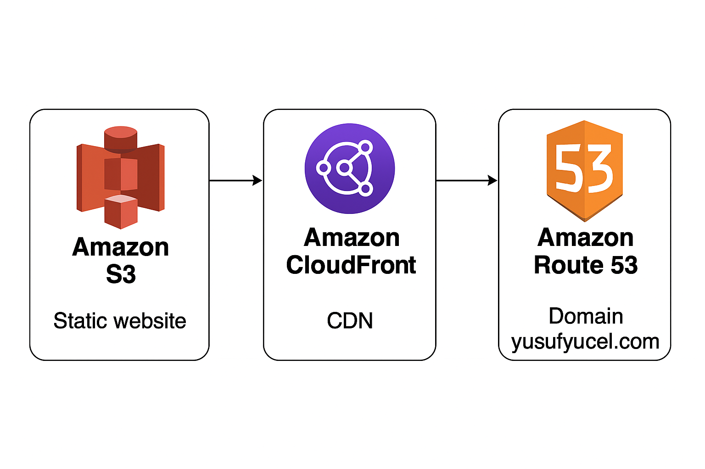
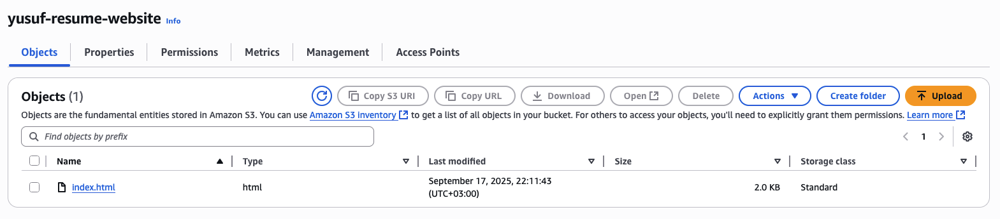
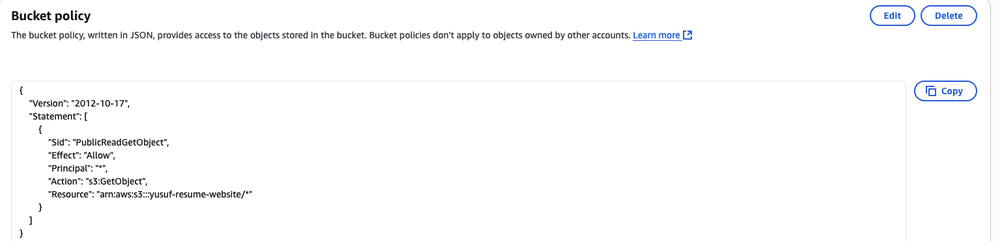
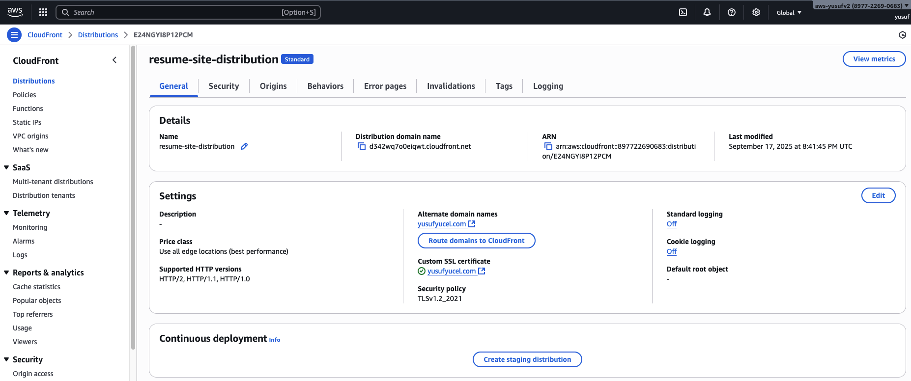
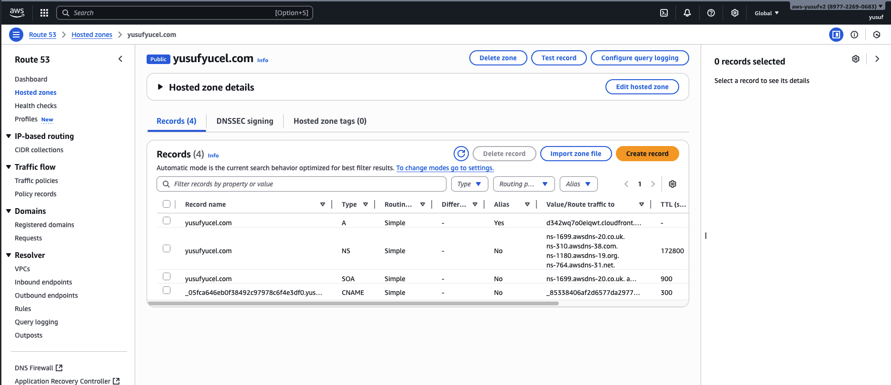
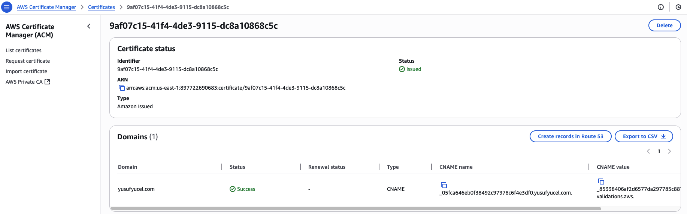

# 🚀 Project: Resume Site on AWS

This project is part of my AWS Cloud & DevOps portfolio.  
I built and deployed a **personal resume website** using Amazon S3, CloudFront, Route 53, and ACM for SSL.

---

## 📌 Architecture
- **Amazon S3** → Hosts the static website (index.html).  
- **Amazon CloudFront** → CDN for global delivery + HTTPS support.  
- **Amazon Route 53** → Custom domain (`yusufyucel.com`).  
- **AWS Certificate Manager (ACM)** → Free SSL certificate.  
## 🎨 Architecture

---
## ⚡ Steps I Followed

1. **Created an S3 bucket**  
   - Enabled static website hosting.  
   - Uploaded `index.html`.  
   

2. **Set bucket policy for public read access**  
   - Allowed `s3:GetObject` for all objects.  
   

3. **Configured CloudFront**  
   - Origin: S3 Website Endpoint.  
   - Redirected HTTP → HTTPS.  
   - Set default root object as `index.html`.  
   

4. **Connected domain with Route 53**  
   - Created a hosted zone.  
   - Added an **A record (Alias)** pointing to CloudFront.  
   

5. **Issued SSL certificate with ACM**  
   - Validated via DNS.  
   - Attached to CloudFront distribution.  
   

---

## 📂 Files in this Repo
- `index.html` → My resume webpage.  
- `diagram.png` → AWS architecture diagram.  
- `README.md` → Project documentation.  

---

## 📸 Demo
🌐 Live Website → [https://yusufyucel.com](https://yusufyucel.com) (not live anymore) 

---

## 👨‍💻 Author
**Yusuf Yücel**  
- 🌐 [yusufyucel.com](https://yusufyucel.com)  
- 💼 [LinkedIn](https://www.linkedin.com/in/yusuf-yucel/)  
- 🐙 [GitHub](https://github.com/yusufyucel-dev)
